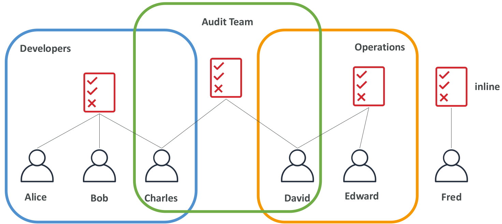
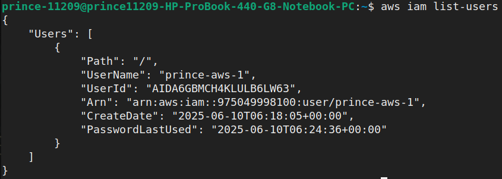

- [IAM - Identity \& Access Management](#iam---identity--access-management)
  - [Exam KeyNotes](#exam-keynotes)
  - [Users \& Groups](#users--groups)
  - [IAM: Permissions](#iam-permissions)
  - [IAM Policies Inheritance](#iam-policies-inheritance)
  - [IAM Policies Structure](#iam-policies-structure)
  - [Multi Factor Authentication - MFA](#multi-factor-authentication---mfa)
  - [MFA devices options in AWS](#mfa-devices-options-in-aws)
  - [How can users access AWS?](#how-can-users-access-aws)
  - [AWS CLI](#aws-cli)
  - [AWS SDK](#aws-sdk)
  - [AWS CLI Setup on Linux](#aws-cli-setup-on-linux)
  - [AWS CloudShell](#aws-cloudshell)
  - [IAM Roles for Services](#iam-roles-for-services)
  - [IAM Security Tools](#iam-security-tools)
  - [IAM Guidelines \& Best Practices](#iam-guidelines--best-practices)
  - [Shared Responsibility Model for IAM](#shared-responsibility-model-for-iam)
  - [IAM Section Summary](#iam-section-summary)

# IAM - Identity & Access Management

## Exam KeyNotes

- IAM Policies Structure
  - `Effect`, `Principal`, `Action`, `Resource`
- Multi Factor Authentication - MFA
- MFA devices options in AWS
- Shared Responsibility Model for IAM

## Users & Groups

- Identity and Access Management
- Global service
- Create users & assign them to group
- Root account created by default, shouldn’t be used or shared
- Users are people within your organization, and can be grouped
- Groups only contain users, not other groups
- Users don’t have to belong to a group, and user can belong to multiple groups


- Why do we create users & why do we create groups?
- _Answer:_ Allow them to use our AWS accounts

## IAM: Permissions

- Users or Groups can be assigned JSON documents called `policies`
- These policies define the permissions of the users
- In AWS, I apply the **least privilege principle**
- Don’t give more permissions than a user needs


## IAM Policies Inheritance

- Attach a policy at the group level
- So, this policy will apply to every single member of the group
- For `Fred` has no group, assign an inline policy
- Inline policy is only attached to a user



## IAM Policies Structure

- Consists of
  - `Version` - Policy language version, always include `2012-10-17`
  - `Id` - An identifier for the policy (**optional**)
  - Statement - One or more individual statements (**required**)
  - Statements consists of
  - `Sid` - An identifier for the statement (**optional**)
  - `Effect` - Whether the statement allows or denies access (`Allow`, `Deny`)
  - `Principal` - account/user/role to which this policy applied to
  - `Action` - List of actions this policy allows or denies
  - `Resource` - List of resources to which the actions applied to
  - `Condition` - Conditions for when this policy is in effect (**optional**)


## Multi Factor Authentication - MFA

- Users have access to your account and can possibly change configurations or delete resources in your AWS account
- **You want to protect your Root Accounts and IAM users**
- MFA = password you know + security device you own
- Main benefit of MFA:
  - _<u>If a password is stolen or hacked, the account is not compromised</u>_


## MFA devices options in AWS

- Virtual MFA device
- Support for multiple tokens on a single device.
  - Google Authenticator (phone only)
  - Authy (phone only)
- Universal 2nd Factor (U2F) Security Key
- Support for multiple root and IAM users using a single security key
  - YubiKey by Yubico (3rd party)
- Hardware Key Fob MFA Device
  - Provided by Gemalto (3rd party)
- Hardware Key Fob MFA Device for AWS GovCloud (US)
  - Provided by SurePassID (3rd party)

## How can users access AWS?

- To access AWS, you have three options:
  - AWS Management Console (protected by password + MFA)
  - AWS Command Line Interface (CLI): protected by access keys
  - AWS Software Developer Kit (SDK) - for code: protected by access keys
- **Access Keys** are generated through the AWS Console
- Users manage their own access keys
- **<u>Access Keys are secret, just like a password. Don’t share them</u>**
- Access Key ID ~= username
- Secret Access Key ~= password

## AWS CLI

- A tool that enables you to interact with AWS services using commands in your command-line shell
- Direct access to the public APIs of AWS services
- You can develop scripts to manage your resources
- It’s open-source https://github.com/aws/aws-cli
- Alternative to using AWS Management Console


## AWS SDK

- AWS Software Development Kit (AWS SDK)
- Language-specific APIs (set of libraries)
- Enables you to access and manage AWS services programmatically
- Embedded within your application
- Supports SDKs (JavaScript, Python, PHP, .NET, Ruby, Java, Go, Node.js, C++)
- Mobile SDKs (Android, iOS, …)
- IoT Device SDKs (Embedded C, Arduino, …)
- _Example:_ AWS CLI is built on AWS SDK for Python

## AWS CLI Setup on Linux

- Run the following commands in terminal

```cmd
curl "https://awscli.amazonaws.com/awscli-exe-linux-x86_64.zip" -o "awscliv2.zip"
unzip awscliv2.zip
sudo ./aws/install
aws --version
```

- Generate **Access Keys** from `IAM > Users > prince-aws-1 > Create access key`
- Select use case as `Command Line Interface (CLI)`
- After, run the following command in terminal

```cmd
aws configure
```

- Provide the informations

```txt
AWS Access Key ID [****************K5WH]: ****************
AWS Secret Access Key [****************XYze]: ****************
Default region name [ap-south-1]: ap-south-1
Default output format [None]:
```

- Provide the following command to check the access

```cmd
aws iam list-users
```



- Removed permissions (From Root Account) from an user, then


## AWS CloudShell

- AWS CloudShell is a terminal in the cloud of AWS
- It's free to use
- It's not available to every region
- I can turn on this CloudShell by clicking terminal icon beside search icon


## IAM Roles for Services

- Some AWS service will need to perform actions on your behalf
- To do so, we will assign permissions to AWS services with IAM Roles
- Common roles:
  - EC2 Instance Roles
  - Lambda Function Roles
  - Roles for CloudFormation
- _For example:_
  - Create an EC2 Instance
  - This instance may want to perform some actions on AWS
  - So, need to give permissions to my EC2 Instance
  - So, create an IAM Role on EC2 Instance
  - Together, it will be made one entity
  - Now, if this EC2 Instance is trying to access some information from the AWS, then it will use the IAM Role
  - And if the permission assigned to the IAM Role is correct, then get the access of these information


## IAM Security Tools

- IAM Credentials Report (account-level)
  - A report that lists all your account's users and the status of their various credentials
- IAM Access Advisor (user-level)
  - Access advisor shows the service permissions granted to a user and when those services were last accessed.
  - You can use this information to revise your policies.
  - Analysis the attached policies & find the not used policies for the long period of time
  - And remove these policies from that user's account

## IAM Guidelines & Best Practices

- Don’t use the root account except for AWS account setup
- One physical user = One AWS user
- **Assign users to groups** and assign permissions to groups
- Create a **strong password policy**
- Use and enforce the use of **Multi Factor Authentication (MFA)**
- Create and use **Roles** for giving permissions to AWS services
- Use Access Keys for Programmatic Access (CLI / SDK)
- Audit permissions of your account using IAM **Credentials Report** & IAM **Access Advisor** (now renamed as **Last Access**)
- _<u>Never share IAM users & Access Keys</u>_

## Shared Responsibility Model for IAM

- Summary:
  - AWS is responsible for all the infrastructures &
  - I am responsible for how I use that infrastructure


## IAM Section Summary

- **Users**: mapped to a physical user, has a password for AWS Console
- **Groups**: contains users only
- **Policies**: JSON document that outlines permissions for users or groups
- **Roles**: for EC2 instances or AWS services
- **Security**: MFA + Password Policy
- **AWS CLI**: manage your AWS services using the command-line
- **AWS SDK**: manage your AWS services using a programming language
- **Access Keys**: access AWS using the CLI or SDK
- **Audit**: IAM Credential Reports & IAM Access Advisor

--- The End ---
