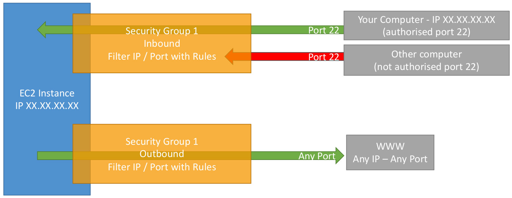
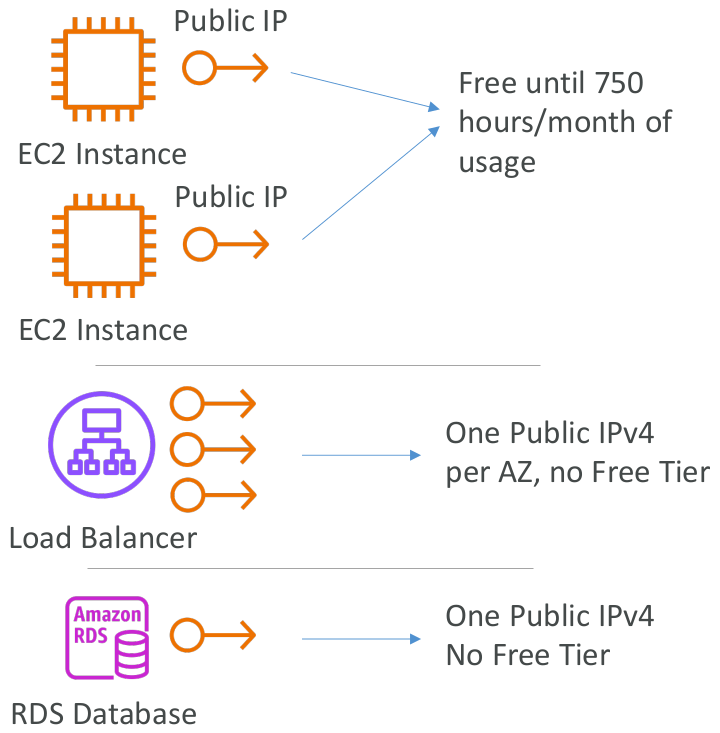

- [EC2 - Elastic Compute Cloud](#ec2---elastic-compute-cloud)
  - [Exam KeyNotes](#exam-keynotes)
  - [Amazon EC2](#amazon-ec2)
  - [EC2 sizing \& configuration options](#ec2-sizing--configuration-options)
  - [EC2 User Data](#ec2-user-data)
  - [EC2 Instance Types: example](#ec2-instance-types-example)
  - [EC2 Instance Types - Overview](#ec2-instance-types---overview)
    - [General Purpose](#general-purpose)
    - [Compute Optimized](#compute-optimized)
    - [Memory Optimized](#memory-optimized)
    - [Storage Optimized](#storage-optimized)
  - [Security Groups](#security-groups)
  - [Security Groups Diagram](#security-groups-diagram)
  - [Security Groups - Good To Know](#security-groups---good-to-know)
  - [Referencing other security groups Diagram](#referencing-other-security-groups-diagram)
  - [Classic Ports to know](#classic-ports-to-know)
  - [SSH Summary Table](#ssh-summary-table)
  - [How to SSH into your EC2 Instance Linux / MacOS](#how-to-ssh-into-your-ec2-instance-linux--macos)
  - [EC2 Instance Roles](#ec2-instance-roles)
  - [EC2 Instances Purchasing Options](#ec2-instances-purchasing-options)
  - [EC2 On Demand](#ec2-on-demand)
  - [EC2 Reserved Instances](#ec2-reserved-instances)
  - [EC2 Savings Plans](#ec2-savings-plans)
  - [EC2 Spot Instances](#ec2-spot-instances)
  - [EC2 Dedicated Hosts](#ec2-dedicated-hosts)
  - [EC2 Dedicated Instances](#ec2-dedicated-instances)
  - [EC2 Capacity Reservations](#ec2-capacity-reservations)
  - [Which purchasing option is right for me?](#which-purchasing-option-is-right-for-me)
  - [AWS charges for IPv4 addresses](#aws-charges-for-ipv4-addresses)
  - [Shared Responsibility Model for EC2](#shared-responsibility-model-for-ec2)
  - [EC2 Section – Summary](#ec2-section--summary)

# EC2 - Elastic Compute Cloud

## Exam KeyNotes

- EC2 Instance Types
- Classic Ports to know
- EC2 Instance Purchasing Options
  - Which type of instance is the right one based on the workload
- Shared Responsibility Model for EC2

## Amazon EC2

- EC2 is one of the most popular of AWS’ offering
- EC2 = Elastic Compute Cloud = Infrastructure as a Service
- It mainly consists in the capability of:
  - Renting virtual machines (EC2)
  - Storing data on virtual drives (EBS)
  - Distributing load across machines (ELB)
  - Scaling the services using an auto-scaling group (ASG)
- Knowing EC2 is fundamental to understand how the Cloud works

## EC2 sizing & configuration options

- Operating System (OS): Linux, Windows or Mac OS
- How much compute power & cores (CPU)
- How much random-access memory (RAM)
- How much storage space:
  - Network-attached (EBS & EFS)
  - hardware (EC2 Instance Store)
- Network card: speed of the card, Public IP address
- Firewall rules: security group
- Bootstrap script (configure at first launch): EC2 User Data

## EC2 User Data

- It is possible to bootstrap our instances using an EC2 User data script.
- Bootstrapping means **launching commands when a machine starts**
- That script is **only run once at the instance first start**
- EC2 user data is used to automate boot tasks such as:
  - Installing updates
  - Installing software
  - Downloading common files from the internet
  - Anything you can think of
- The EC2 User Data Script runs with the **root user**

## EC2 Instance Types: example

- To know about all the instance types [link](https://instances.vantage.sh/)


## EC2 Instance Types - Overview

- Different types of EC2 instances that are optimized for different use cases [link](https://aws.amazon.com/ec2/instance-types/)
- AWS has the following naming convention:
  - `m5.2xlarge`
- `m` - instance class
- `5` - generation (AWS improves them over time)
- `2xlarge` - size within the instance class (more size - more cpu, ram & storage)

### General Purpose

- Great for a diversity of workloads such as **web servers or code repositories**
- Balance between:
  - Compute
  - Memory
  - Networking
- `t2.micro` which is a General Purpose EC2 Instance

### Compute Optimized

- Great for compute-intensive tasks that require high performance processors:
  - Batch processing workloads
  - Media transcoding
  - High performance web servers
  - High performance computing (HPC)
  - Scientific modeling & machine learning
  - Dedicated gaming servers
- Those instances start with `C` (CPU), for example: `C6g`, `C6gn`, `C5` etc

### Memory Optimized

- Fast performance for workloads that process large data sets in memory
- Use cases:
  - High performance, relational/non-relational databases
  - Distributed web scale cache stores
  - In-memory databases optimized for BI (business intelligence)
  - Applications performing real-time processing of big unstructured data
- Those instances start with `R` (RAM), for example: `R6g`, `R5`, `R5a` etc

### Storage Optimized

- Great for storage-intensive tasks that require high, sequential read and write access to large data sets on local storage
- Use cases:
  - High frequency online transaction processing (OLTP) systems
  - Relational & NoSQL databases
  - Cache for in-memory databases (for example, Redis)
  - Data warehousing applications
  - Distributed file systems
- Those instances start with `I`, `D` & `H`, for example: `I3`, `D2`, `H1` etc

## Security Groups

- Security Groups are the fundamental of network security in AWS
- They control how traffic is allowed into or out of our EC2 Instances.
- Security groups only contain `allow` rules
- Security groups rules can reference by IP or by security group


- Security groups are acting as a **firewall** on EC2 instances
- They regulate:
  - Access to Ports
  - Authorised IP ranges – IPv4 and IPv6
  - Control of inbound network (from other to the instance)
  - Control of outbound network (from the instance to other)


## Security Groups Diagram

- For other computer, firewall blocks their request as not authorised
- And it will be a timeout



## Security Groups - Good To Know

- Can be attached to multiple instances
- Locked down to a region / VPC combination
- Does live **outside** the EC2 – if traffic is blocked the EC2 instance won’t see it
- It’s good to maintain one separate security group for SSH access
- If your application is not accessible (time out), then it’s a security group issue
- If your application gives a **connection refused** error, then it’s an application error or it’s not launched
- All inbound traffic is blocked by default
- All outbound traffic is authorised by default

## Referencing other security groups Diagram

- Inbound rules are authorizing SG1 & SG2
- As SG1 & SG2 are allowed for any instances, first 2 can access
- last instance can't access as no SG3 is authorized for inbound rules


## Classic Ports to know

- `22` = SSH (Secure Shell) - log into a Linux instance
- `21` = FTP (File Transfer Protocol) – upload files into a file share
- `22` = SFTP (Secure File Transfer Protocol) – upload files using SSH
- `80` = HTTP – access unsecured websites
- `443` = HTTPS – access secured websites
- `3389` = RDP (Remote Desktop Protocol) – log into a Windows instance

## SSH Summary Table


## How to SSH into your EC2 Instance Linux / MacOS

- Before using SSH connection, must check the open `22` port for inbound rule
- SSH allows to control a remote machine using the command line
- Configure OpenSSH `~/.ssh/config` to facilitate the SSH into our EC2 instances


- Use `ec2-user` as Amazon Linux 2 AMI has one user already set up for me named `ec2-user`
- I already have downloaded the key-pair pem file on a folder
- Traverse that folder and open the terminal
- And provide the file permission first

```cmd
chmod 400 <pem-file.pem>
ssh -i <pem-file.pem> ec2-user@<instance-public-ip-address>
```


## EC2 Instance Roles

- Providing the AWS IAM configuration in the EC2 instance terminal is very bad idea
- As my personal details on this EC2 instance is accessed by anyone (working in a team) else connect to my EC2 instance & retrieved the value of these credentials in my instance


- Instead, I have to use **IAM Role**
- Create a IAM Role in IAM section with **IAMReadOnlyAccess** policy
- In the instance, set that IAM Role from `Actions > Security > Modify IAM Role` & set role
- So, providing AWS Credentials using IAM Role
- Now I can access `list-users` without prividing any credentials


## EC2 Instances Purchasing Options

- A

## EC2 On Demand

- A

## EC2 Reserved Instances

- A

## EC2 Savings Plans

- A

## EC2 Spot Instances

- A

## EC2 Dedicated Hosts

- A

## EC2 Dedicated Instances

- A

## EC2 Capacity Reservations

- A

## Which purchasing option is right for me?

- **On demand:** coming and staying in resort whenever we like, we pay the full price
- **Reserved:** like planning ahead and if we plan to stay for a long time, we may get a good discount.
- **Savings Plans:** pay a certain amount per hour for certain period and stay in any room type (e.g., King, Suite, Sea View, …)
- **Spot instances:** the hotel allows people to bid for the empty rooms and the highest bidder keeps the rooms. You can get kicked out at any time
- **Dedicated Hosts:** We book an entire building of the resort
- **Capacity Reservations:** you book a room for a period with full price even you don’t stay in it

## AWS charges for IPv4 addresses

- Starting February 1st 2024, there’s a charge for all Public IPv4 created in your account
- **`$0.005` per hour of Public IPv4 (`~$3.6` per month)**
- For new accounts in AWS, you have a free tier for the EC2 service: 750 hours of Public IPv4 per month for the first 12 months
- For all other services there is no free tier
- You can test IPv6 by going to [IPv6 test link](https://test-ipv6.com/)
- How to troubleshoot charges?
  - Go into your AWS Bill
  - Look into the AWS Public IP Insights service
  - [Nice article here](https://repost.aws/articles/ARknH_OR0cTvqoTfJrVGaB8A/why-am-i-seeing-charges-for-public-ipv4-addresses-when-i-am-under-the-aws-free-tier)



## Shared Responsibility Model for EC2


## EC2 Section – Summary

- **EC2 Instance:** AMI (OS) + Instance Size (CPU + RAM) + Storage + security groups + EC2 User Data
- **Security Groups:** Firewall attached to the EC2 instance
- **EC2 User Data:** Script launched at the first start of an instance
- **SSH:** start a terminal into our EC2 Instances (port 22)
- **EC2 Instance Role:** link to IAM roles
- **Purchasing Options:** On-Demand, Spot, Reserved (Standard + Convertible), Dedicated Host, Dedicated Instance

--- The End ---
