- [EC2 Instance Storage](#ec2-instance-storage)
  - [Exam KeyNotes](#exam-keynotes)
  - [EBS Volume](#ebs-volume)
    - [EBS – Delete on Termination attribute](#ebs--delete-on-termination-attribute)
  - [EBS Snapshots](#ebs-snapshots)
    - [EBS Snapshots Features](#ebs-snapshots-features)
  - [AMI](#ami)
    - [AMI Process (from an EC2 instance)](#ami-process-from-an-ec2-instance)
  - [EC2 Image Builder](#ec2-image-builder)
  - [EC2 Instance Store](#ec2-instance-store)
  - [EFS - Elastic File System](#efs---elastic-file-system)
    - [EBS vs EFS](#ebs-vs-efs)
    - [EFS Infrequent Access (EFS-IA)](#efs-infrequent-access-efs-ia)
  - [Shared Responsibility Model for EC2 Storage](#shared-responsibility-model-for-ec2-storage)
  - [Amazon FSx](#amazon-fsx)
    - [Amazon FSx for Windows File Server](#amazon-fsx-for-windows-file-server)
    - [Amazon FSx for Lustre](#amazon-fsx-for-lustre)
  - [Summary](#summary)

# EC2 Instance Storage

## Exam KeyNotes

- EBS – Delete on Termination attribute
- EC2 Image Builder
- EBS vs EFS
- EFS Infrequent Access (EFS-IA)
- Amazon FSx
- Amazon FSx for Windows File Server
- Amazon FSx for Lustre

## EBS Volume

- IOPS (Operations Per Seconds)
- An EBS (Elastic Block Store) Volume is a **network drive**
- I can attact to my instances while they run
- It allows my instances to persist data, even after their termination
- They can only be mounted to one instance at a time (at the CCP level)
- They are bound to a specific availability zone (AZ)
- **Analogy:** Think of them as a **network USB stick**
- **Free tier:** 30 GB of free EBS storage of type General Purpose (SSD) or Magnetic per month
- It’s a network drive (i.e. not a physical drive)
  - It uses the network to communicate the instance, which means there might be a bit of latency
  - It can be detached from an EC2 instance and attached to another one quickly
- It’s locked to an Availability Zone (AZ)
  - An EBS Volume in `us-east-1a` cannot be attached to `us-east-1b`
  - To move a volume across, you first need to **snapshot** it
- Have a provisioned capacity (size in GBs, and IOPS i.e. Operations Per Seconds)
  - You get billed for all the provisioned capacity
  - You can increase the capacity of the drive over time

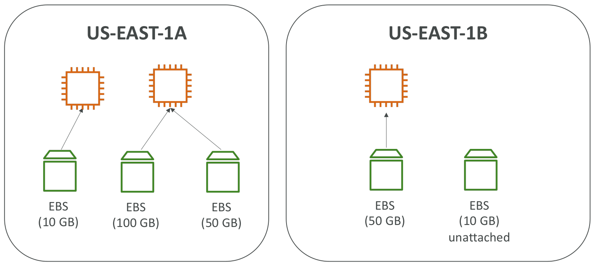

### EBS – Delete on Termination attribute

- Controls the EBS behaviour when an EC2 instance terminates
  - By default, the root EBS volume is deleted (attribute enabled)
  - By default, any other attached EBS volume is not deleted (attribute disabled)
- This can be controlled by the AWS console / AWS CLI
- **Use case:** Preserve root volume when instance is terminated

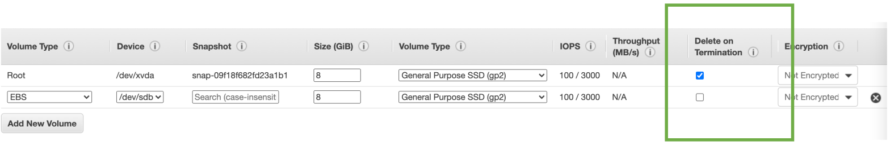

## EBS Snapshots

- Make a backup (snapshot) of your EBS volume at a point in time
- Not necessary to detach volume to do snapshot, but recommended
- Can copy snapshots across Availability Zone (AZ) or Region
- For example:
  - I have a EBS volume attached to my EC2 instance in `us-east-1a`
  - I snapshot that volume in stop or running state
  - Now the EBS snapshot exist in my region
  - That EBS snapshot can be used to restore (make a copy) a new EBS volume in another Availability Zone
  - Now I can attach the new EBS volume to an EC2 instance in `us-east-2b`

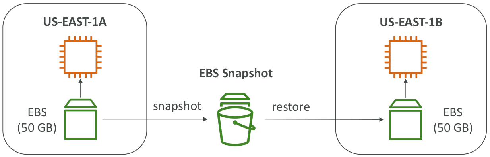

### EBS Snapshots Features

- EBS Snapshot Archive
  - Move a Snapshot to an **archive tier** that is **75% cheaper**
  - Takes within **24 to 72 hours** for restoring the archive
- Recycle Bin for EBS Snapshots
  - Setup rules to retain deleted snapshots so you can recover them after an accidental deletion
  - Specify retention (from 1 day to 1 year)
- It's used for disaster recovery strategy
- From a snapshot, I can restore volume accross different availability zone
- **Recycle Bin:** Protect your Amazon EBS Snapshots and Amazon Machine Images (AMIs) from accidental deletion.

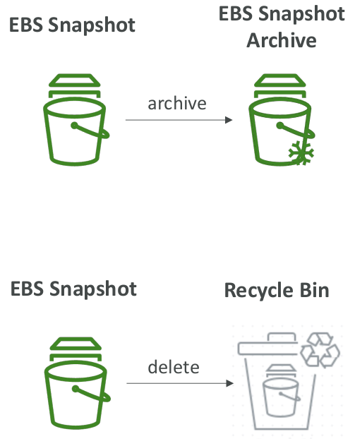

## AMI

- Amazon Machine Image
- AMI are a customization of an EC2 instance
  - You add your own software, configuration, operating system, monitoring…
  - Faster boot / configuration time because all your softwares are pre-packaged
- AMI are built for a specific region (and can be copied across regions)
- You can launch EC2 instances from:
  - **A Public AMI:** AWS provided
  - **Your own AMI:** you make and maintain them yourself
  - **An AWS Marketplace AMI:** an AMI someone else made (and potentially sells)

### AMI Process (from an EC2 instance)

- Start an EC2 instance and customize it
- Stop the instance (for data integrity)
- Build an AMI – this will also create EBS snapshots
- Launch instances from other AMIs

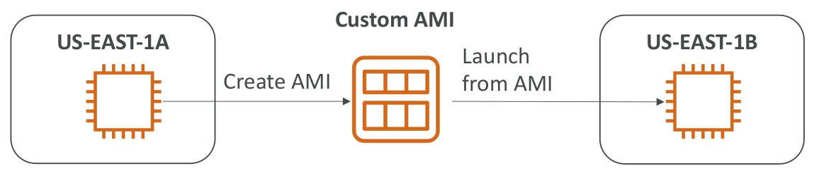

## EC2 Image Builder

- Used to automate the creation of Virtual Machines or container images
- => Automate the creation, maintain, validate and test EC2 AMIs
- Can be run on a schedule (weekly, whenever packages are updated, etc…)
- Free service (only pay for the underlying resources)

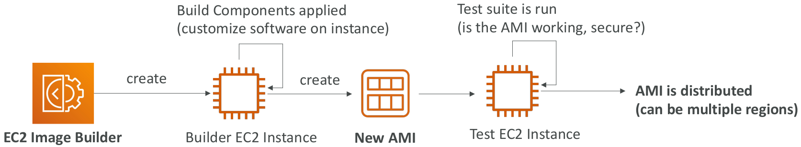

## EC2 Instance Store

- Used for short term use, for long term EBS is good
- EBS volumes are network drives with good but “limited” performance
- **<u>If you need a high-performance hardware disk, use EC2 Instance Store</u>**
- Usecase:
  - Better I/O performance
  - EC2 Instance Store lose their storage if they’re stopped (ephemeral)
  - Good for buffer / cache / scratch data / temporary content
  - Risk of data loss if hardware fails
  - Backups and Replication are your responsibility
- **Exam Tips**
  - High performance hardware attached volume for the EC2 instances
  - _Think:_ **Local EC2 Instance Store**

## EFS - Elastic File System

- Managed NFS (network file system) that can be mounted on 100s of EC2 at a time
- But EBS can be mounted only 1 EC2 at a time
- Shared network file system or shared NFS
- EFS works with Linux EC2 instances in multi-AZ
- Highly available, scalable, expensive (3x gp2), pay per use, no capacity planning

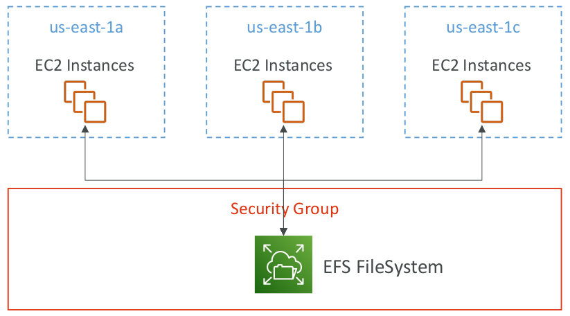

### EBS vs EFS

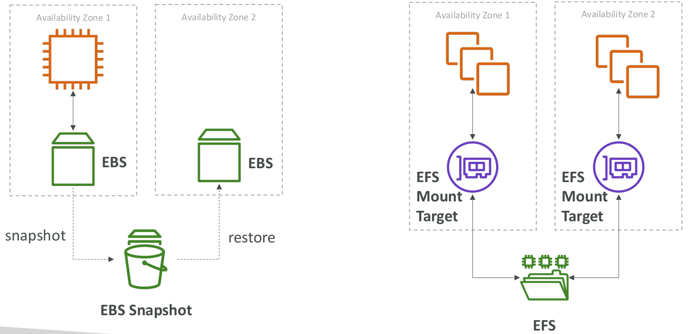

### EFS Infrequent Access (EFS-IA)

- It's a **cost saving optimization**
- Storage class that is cost-optimized for files not accessed every day
- Up to 92% lower cost compared to EFS Standard
- EFS will automatically move your files to EFS-IA based on the last time they were accessed
- Enable EFS-IA with a Lifecycle Policy
- Example: move files that are not accessed for 60 days to EFS-IA
- Transparent to the applications accessing EFS

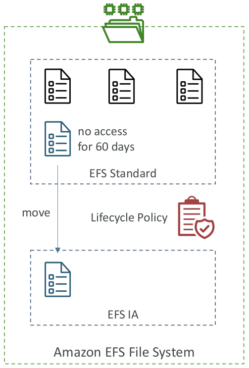

## Shared Responsibility Model for EC2 Storage

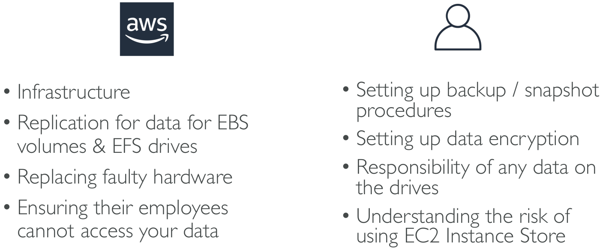

## Amazon FSx

- Launch 3rd party high-performance file systems on AWS
- Fully managed service
  - Amazon FSx for lustre
  - Amazon FSx for Windows File Server
  - Amazon FSx for NetApp ONTAP

### Amazon FSx for Windows File Server

- A fully managed, highly reliable, and scalable Windows native shared file system
- Built on Windows File Server
- Supports SMB protocol & Windows NTFS
- Integrated with Microsoft Active Directory
- Can be accessed from AWS or your on-premise infrastructure

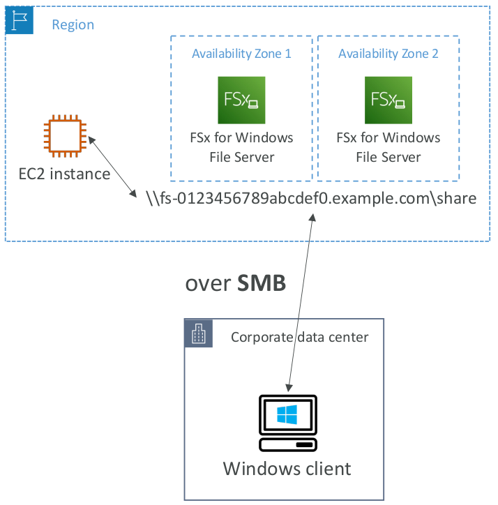

### Amazon FSx for Lustre

- A fully managed, high-performance, scalable file storage for High Performance Computing (HPC)
- The name Lustre is derived from **Linux** and **cluster**
- Machine Learning, Analytics, Video Processing, Financial Modeling etc
- Scales up to 100s GB/s, millions of IOPS, sub-ms latencies
- **Exam Tips**
  - High Performance Computing (HPC)
  - _Think:_ **Amazon FSx for Lustre**

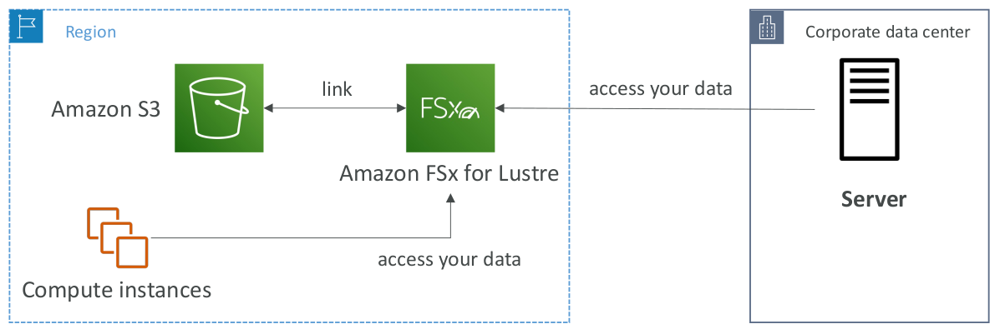

## Summary

- **EBS volumes:**
  - Network drives attached to one EC2 instance at a time
  - Mapped to an Availability Zones
  - Can use EBS Snapshots for backups / transferring EBS volumes across AZ
- **AMI:** create ready-to-use EC2 instances with our customizations
- **EC2 Image Builder:** automatically build, test and distribute AMIs
- **EC2 Instance Store:**
  - High performance hardware disk attached to our EC2 instance
  - Lost if our instance is stopped / terminated
- **EFS:** network file system, can be attached to 100s of instances in a region
- **EFS-IA:** cost-optimized storage class for infrequent accessed files
- **FSx for Windows:** Network File System for Windows servers
- **FSx for Lustre:** High Performance Computing Linux file system

--- The End ---
