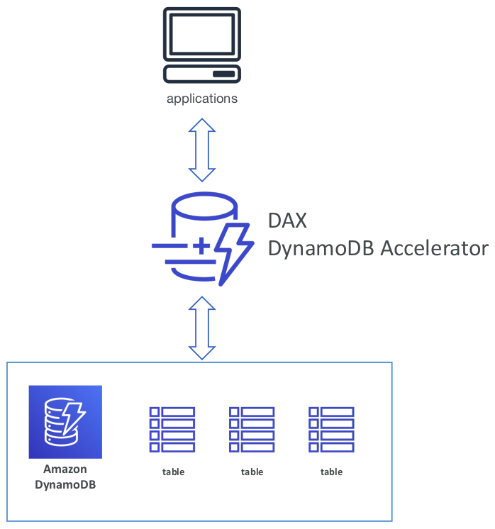

- [Databases \& Analytics](#databases--analytics)
  - [Exam KeyNotes](#exam-keynotes)
  - [Introduction](#introduction)
  - [Relational Databases](#relational-databases)
  - [NoSQL Databases](#nosql-databases)
    - [JSON](#json)
  - [Databases \& Shared Responsibility on AWS](#databases--shared-responsibility-on-aws)
  - [Amazon RDS](#amazon-rds)
    - [Advantage over using RDS versus deploying DB on EC2](#advantage-over-using-rds-versus-deploying-db-on-ec2)
    - [RDS Solution Architecture](#rds-solution-architecture)
    - [Amazon RDS Snapshot](#amazon-rds-snapshot)
    - [Amazon Aurora](#amazon-aurora)
    - [Amazon Aurora Serverless](#amazon-aurora-serverless)
  - [RDS Deployments:](#rds-deployments)
    - [Read Replicas](#read-replicas)
    - [Multi-AZ](#multi-az)
    - [Multi-Region](#multi-region)
  - [Amazon ElastiCache](#amazon-elasticache)
    - [ElastiCache Solution Architecture - Cache](#elasticache-solution-architecture---cache)
  - [DynamoDB](#dynamodb)
    - [DynamoDB – type of data](#dynamodb--type-of-data)
    - [DynamoDB Accelerator - DAX](#dynamodb-accelerator---dax)
    - [DynamoDB - Global Tables](#dynamodb---global-tables)
  - [Redshift](#redshift)
  - [Redshift Serverless](#redshift-serverless)
  - [Amazon EMR](#amazon-emr)
  - [Amazon Athena](#amazon-athena)
  - [Amazon QuickSight](#amazon-quicksight)
  - [DocumentDB](#documentdb)
  - [Amazon Neptune](#amazon-neptune)
  - [Amazon Timestream](#amazon-timestream)
  - [Amazon QLDB](#amazon-qldb)
  - [Amazon Managed Blockchain](#amazon-managed-blockchain)
  - [AWS Glue](#aws-glue)
  - [DMS – Database Migration Service](#dms--database-migration-service)
  - [Summary](#summary)

# Databases & Analytics

## Exam KeyNotes

- Which database is best fit for based on given conditions
- Amazon RDS
- Amazon Aurora
- RDS Deployment
- Amazon ElasticCache
- DynamoDB
- DynamoDB Accelerator - DAX
- DynamoDB - Global Tables

## Introduction

- Storing data on disk (EFS, EBS, EC2 Instance Store, S3) can have its limits
- Sometimes, I want to store data in a database
- I can **structure** the data
- I build **indexes** to efficiently query / search through the data
- I define **relationships** between my **datasets**
- Databases are **optimized for a purpose** and come with different features, shapes and constraints

## Relational Databases

- Looks just like Excel spreadsheets, with links between them!
- Can use the SQL language to perform queries / lookups

## NoSQL Databases

- NoSQL needs horizontal scaling
- But Relational database need vertical scaling
- NoSQL = non-SQL = non relational databases
- NoSQL databases are purpose built for specific data models and have flexible schemas for building modern applications
- Benefits:
  - **Flexibility:** easy to evolve data model
  - **Scalability:** designed to scale-out by using distributed clusters
  - **High-performance:** optimized for a specific data model
  - **Highly functional:** types optimized for the data model
- Examples: Key-value, document, graph, in-memory, search databases

### JSON

- JSON = JavaScript Object Notation
- JSON is a common form of data that fits into a NoSQL model
- Data can be nested
- Fields can change over time
- Support for new types: arrays, etc

## Databases & Shared Responsibility on AWS

- AWS offers use to **manage** different databases
- Benefits include:
  - Quick Provisioning, High Availability, Vertical and Horizontal Scaling
  - Automated Backup & Restore, Operations, Upgrades
  - Operating System Patching is handled by AWS
  - Monitoring, alerting
- **Note:** many databases technologies could be run on EC2, but you must handle myself the resiliency, backup, patching, high availability, fault tolerance, scaling…

## Amazon RDS

- RDS stands for Relational Database Service
- It’s a **managed DB service** for DB use **SQL as a query language**
- It allows you to create databases in the cloud that are managed by AWS
  - Postgres
  - MySQL
  - MariaDB
  - Oracle
  - Microsoft SQL Server
  - IBM DB2
  - Aurora (AWS Proprietary database)

### Advantage over using RDS versus deploying DB on EC2

- RDS is a managed service:
  - Automated provisioning, OS patching
  - Continuous backups and restore to specific timestamp (Point in Time Restore)!
  - Monitoring dashboards
  - Read replicas for improved read performance
  - Multi AZ setup for DR (Disaster Recovery)
  - Maintenance windows for upgrades
  - Scaling capability (vertical and horizontal)
  - Storage backed by EBS
- BUT I can’t SSH into your instances

### RDS Solution Architecture

- It's a classic solution architecture
  - Load balancer layer is taking the web request
  - The backend EC2 instance is doing the application logic
  - The database tier/layer is doing the read/write of the data

### Amazon RDS Snapshot

- Restore snapshot -
- Copy snapshot -
- Restore snapshot -

### Amazon Aurora

- Aurora is a proprietary technology from AWS (not open sourced)
- **PostgreSQL** and **MySQL** are both supported as **Aurora DB**
- Aurora is **AWS cloud optimized** and claims `5x` performance improvement over MySQL on RDS, over `3x` the performance of Postgres on RDS
- Aurora storage automatically grows in increments of `10GB`, up to `128TB`
- Aurora costs more than RDS (`20%` more) – but is more efficient
- Not in the free tier

### Amazon Aurora Serverless

- Automated database instantiation and auto-scaling based on actual usage
- PostgreSQL and MySQL are both supported as Aurora Serverless DB
- No capacity planning needed
- Least management overhead
- Pay per second, can be more cost-effective
- Use cases: good for infrequent, intermittent or unpredictable workloads…
- **Exam Tips**
  - Aurora with no management overhead
  - _Think:_ **Aurora serverless**

## RDS Deployments:

### Read Replicas

- Scale the read workload of your DB
- Can create up to 15 Read Replicas
- Data is only written to the main DB

### Multi-AZ

- Failover in case of AZ outage (high availability)
- Data is only read/written to the main database
- Can only have 1 other AZ as failover

### Multi-Region

- Multi-Region (Read Replicas)
  - **Disaster recovery** in case of region issue
  - **Local performance** for global reads
  - Replication cost

## Amazon ElastiCache

- The same way RDS is to get managed Relational Databases
- ElastiCache is to get managed Redis or Memcached
- Caches are in-memory databases with high performance, low latency
- Helps reduce load off databases for read intensive workloads
- AWS takes care of OS maintenance / patching, optimizations, setup, configuration, monitoring, failure recovery and backups
- **Exam Tips**
  - In memory database
  - _Think:_ **Amazon ElastiCache**

### ElastiCache Solution Architecture - Cache

## DynamoDB

- Fully Managed Highly available with replication across 3 AZ
- **NoSQL database - not a relational database**
- Scales to massive workloads, distributed “serverless” database
- Millions of requests per seconds, trillions of row, 100s of TB of storage
- Fast and consistent in performance
- **Single-digit millisecond latency – low latency retrieval**
- Integrated with IAM for security, authorization and administration
- Low cost and auto scaling capabilities
- Standard & Infrequent Access (IA) Table Class
- **Exam Tips**
  - Serverless or single digit milisecond latency or low latency
  - _Think:_ **DynamoDB**

### DynamoDB – type of data

- DynamoDB is a key/value database

### DynamoDB Accelerator - DAX

- Fully Managed **in-memory cache** for DynamoDB
- **10x performance improvement** – single-digit millisecond latency to microseconds latency – when accessing your DynamoDB tables
- Secure, highly scalable & highly available
- Difference with ElastiCache at the CCP level: DAX is only used for and is integrated with DynamoDB, while ElastiCache can be used for other databases

### DynamoDB - Global Tables

- Make a DynamoDB table accessible with low latency in multiple-regions
- Active-Active replication (read/write to any AWS Region)

## Redshift

## Redshift Serverless

## Amazon EMR

## Amazon Athena

## Amazon QuickSight

## DocumentDB

## Amazon Neptune

## Amazon Timestream

## Amazon QLDB

## Amazon Managed Blockchain

## AWS Glue

## DMS – Database Migration Service

## Summary
